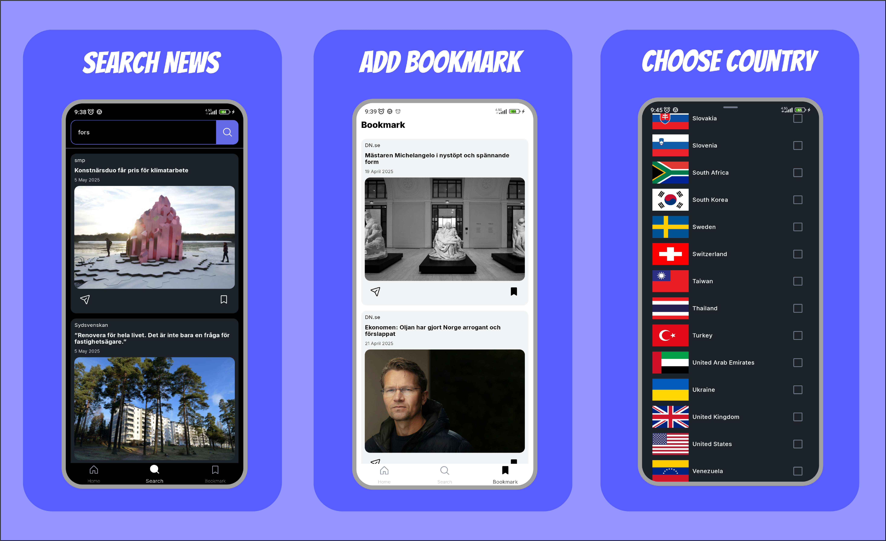

# 📰 Headlinr

**Headlinr** is a modern news reader app built using **Jetpack Compose Multiplatform**, targeting
both **Android** and **iOS** platforms. It delivers real-time news headlines tailored to the user's
country, with the flexibility to search and bookmark favorite articles.

---

## Screenshots




## 🌍 Features

- ✨ Built with **Compose Multiplatform** for shared UI across Android and iOS.
- 📍 Detects user's **current country** and fetches headlines accordingly using
  the [MediaStack API](https://mediastack.com/).
- 🌐 Allows **manual country selection** with instant updates to the news feed.
- 💾 Stores selected country locally using **Room database**.
- 🔎 Supports **searching** for news within the selected country.
- 📑 View **full article details** within the app.
- 🌐 Easily **open articles in the browser** to read more.
- 🔖 Save favorite news to **bookmarks** for quick access later.

---

## 🛠 Tech Stack

| Layer                | Library                                                                  |
|----------------------|--------------------------------------------------------------------------|
| UI                   | Compose Multiplatform                                                    |
| Dependency Injection | [Koin](https://insert-koin.io/)                                          |
| Image Loading        | [Coil](https://coil-kt.github.io/coil/)                                  |
| Networking           | [Ktor Client](https://ktor.io/)                                          |
| Persistence          | [Room](https://developer.android.com/jetpack/androidx/releases/room)     |
| Pagination           | [Multiplatform Paging](https://github.com/cashapp/multiplatform-paging) |

---

## 📱 Screens

- 📰 Headlines by Country
- 🌍 Country Picker with Flags
- 🔎 Search Results
- 📄 News Detail with Full Article Option
- 🔖 Bookmarks

---

## 🏁 Getting Started

### Prerequisites

- Android Studio Giraffe or later
- Kotlin Multiplatform Mobile plugin
- MediaStack API Key

## ⚙️ Setup

1. Clone the repository:

   ```bash
   git clone https://github.com/MuhammetKonukcu/Headlinr.git
   ```
2. Add your MediaStack API token to `local.properties` in the project root:

   ```properties
   news_auth_token=YOUR_TMDB_API_TOKEN_HERE
   ```

3. Select Android or iOS simulator

4. Build & run the app

## 📄 License

This project is licensed under the MIT License.
